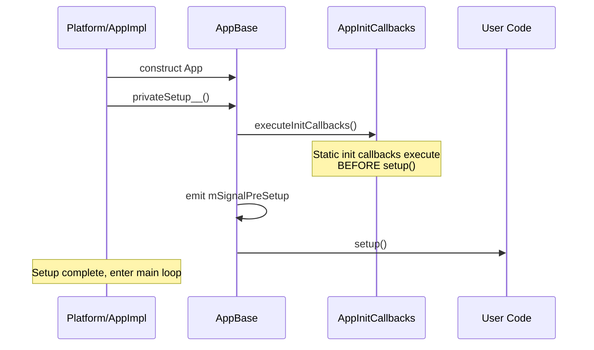
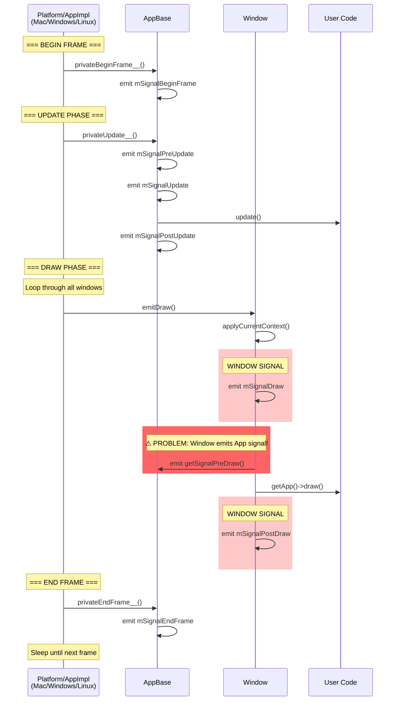

# Current Cinder App Lifecycle Flow

This diagram shows the actual flow of a Cinder application as currently implemented.

## Startup Phase



## Main Loop (Per Frame)



## Key Problems with Current Implementation

### 1. Wrong Signal Emission Order
```cpp
void Window::emitDraw()
{
    applyCurrentContext();

    mSignalDraw.emit();                    // ❌ Window signal fires FIRST
    getApp()->getSignalPreDraw().emit();   // ❌ App "PRE-draw" signal fires SECOND
    getApp()->draw();
    mSignalPostDraw.emit();
}
```

**Issue:** The window's `mSignalDraw` fires *before* the app's `PreDraw` signal, which is semantically backwards. Something called "PreDraw" should happen before drawing starts, not after the window has already started its draw sequence.

### 2. Responsibility Violation
The Window class is reaching back into the App to emit app-level signals. This creates:
- **Tight coupling** between Window and App
- **Unclear ownership** - who owns the PreDraw signal timing?
- **Inconsistency** - Update phase emits signals at App level, Draw phase emits them at Window level

### 3. Architectural Inconsistency

**Update Phase (Correct):**
```
Platform -> App.privateUpdate__()
         -> App emits PreUpdate signal
         -> App calls update()
         -> App emits PostUpdate signal
```

**Draw Phase (Incorrect):**
```
Platform -> Window.emitDraw()
         -> Window emits window.Draw signal
         -> Window emits APP.PreDraw signal ❌
         -> Window calls app.draw()
         -> Window emits window.PostDraw signal
```

The Update phase is clean - all app signals at app level. The Draw phase is messy - app signals buried inside window code.

## Signal Hierarchy

### App-Level Signals (Global, once per frame)
- `mSignalBeginFrame` - Start of frame ✓ Emitted at App level
- `mSignalPreUpdate` - Before update() ✓ Emitted at App level
- `mSignalUpdate` - During update phase ✓ Emitted at App level
- `mSignalPostUpdate` - After update() ✓ Emitted at App level
- `mSignalPreDraw` - Before draw() ❌ Emitted at Window level (WRONG!)
- `mSignalEndFrame` - End of frame ✓ Emitted at App level

### Window-Level Signals (Per window, for multi-window apps)
- `mSignalDraw` - Window-specific pre-draw setup
- `mSignalPostDraw` - Window-specific post-draw cleanup
- `mSignalResize`, `mSignalMove`, etc.

## Multi-Window Implications

In a multi-window app, the current implementation means:

```
BeginFrame signal (once)
PreUpdate signal (once)
Update signal (once)
update() (once)
PostUpdate signal (once)

For each window:
    Window.mSignalDraw (window A)
    App.PreDraw signal (FIRES ONCE PER WINDOW! ❌)
    app.draw() (with window A as current)
    Window.mSignalPostDraw (window A)

    Window.mSignalDraw (window B)
    App.PreDraw signal (FIRES AGAIN! ❌)
    app.draw() (with window B as current)
    Window.mSignalPostDraw (window B)

EndFrame signal (once)
```

The app-level `PreDraw` signal fires **multiple times** (once per window), which is wrong for an app-level signal!

## What It Should Be

The app-level PreDraw signal should fire **once** at the app implementation level, before the window loop begins, just like PreUpdate:

```
Platform loop:
    privateBeginFrame__() -> emit BeginFrame signal
    privateUpdate__() -> emit PreUpdate, Update, call update(), emit PostUpdate

    emit PreDraw signal ← HERE, at app level, ONCE

    for each window:
        window.emitDraw() -> emit window.Draw, call app.draw(), emit window.PostDraw

    privateEndFrame__() -> emit EndFrame signal
```
