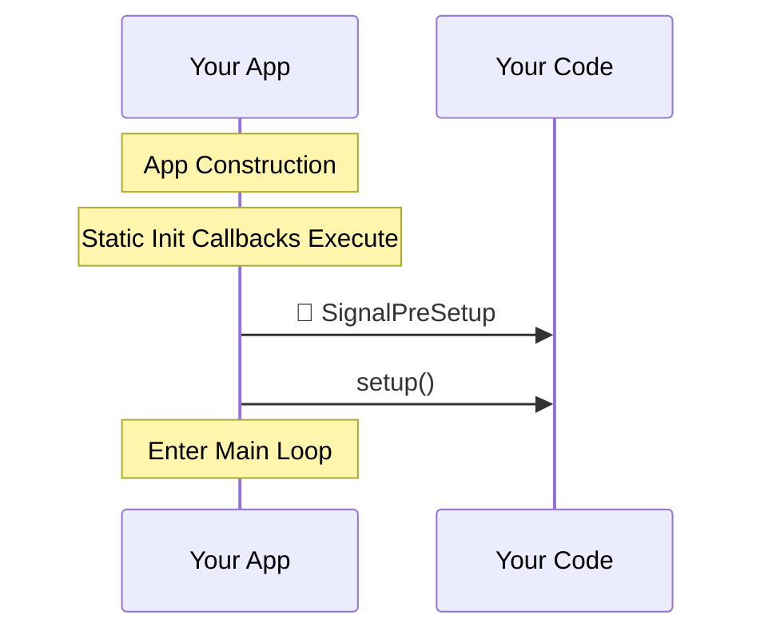
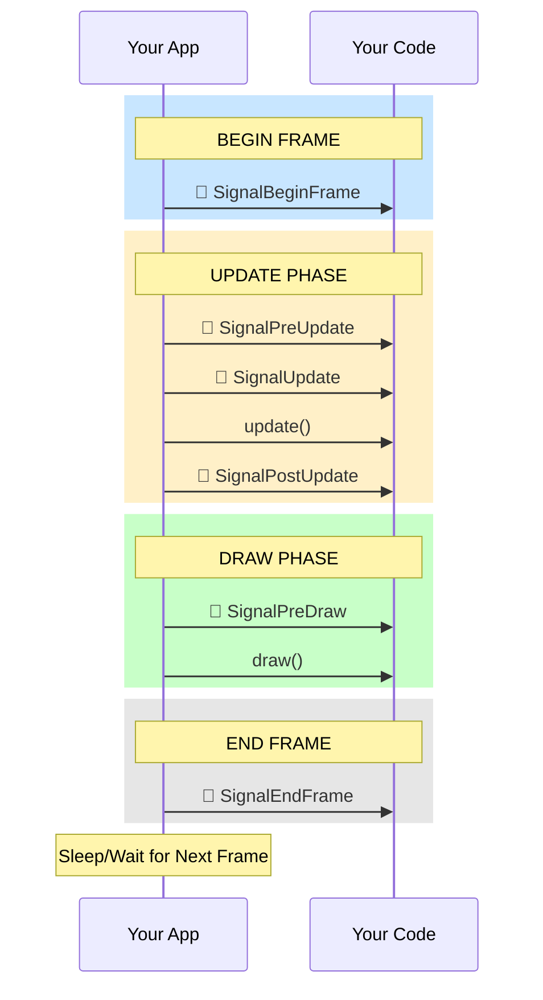
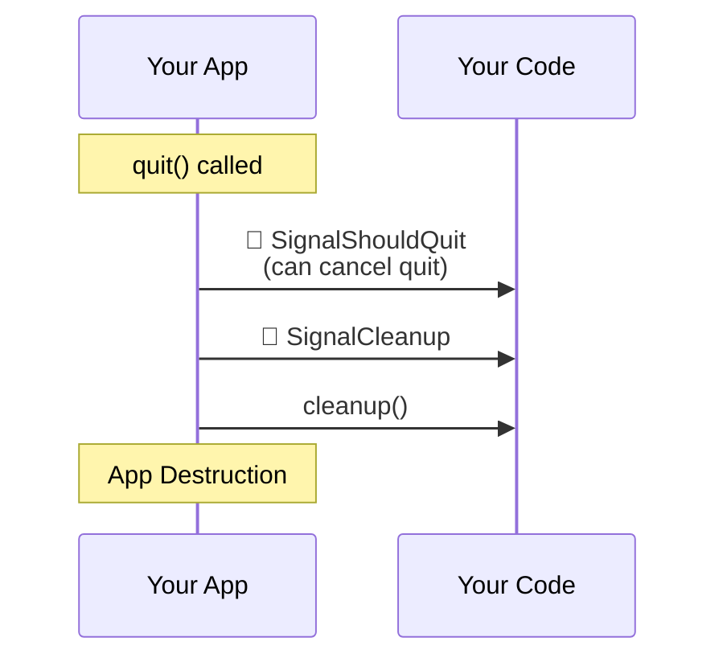

# Cinder Application Lifecycle - User Perspective

This shows the intended order of signals and callbacks from the user's perspective.

## Startup



## Main Loop (Every Frame)



## Shutdown



## Complete Frame Timeline

```
TIME →

Startup:
  ├─ App Construction
  ├─ Static Init Callbacks
  ├─ 📢 SignalPreSetup
  └─ setup()

Main Loop (repeats):
  │
  ├─ 📢 SignalBeginFrame ────────┐
  │                               │
  ├─ 📢 SignalPreUpdate          │
  ├─ 📢 SignalUpdate             ├─ Frame N
  ├─ update()                    │
  ├─ 📢 SignalPostUpdate         │
  │                               │
  ├─ 📢 SignalPreDraw            │
  ├─ draw()                      │
  │                               │
  └─ 📢 SignalEndFrame ──────────┘

  Sleep until next frame

  ├─ 📢 SignalBeginFrame ────────┐
  ├─ 📢 SignalPreUpdate          │
  ├─ 📢 SignalUpdate             ├─ Frame N+1
  ├─ update()                    │
  ├─ 📢 SignalPostUpdate         │
  ├─ 📢 SignalPreDraw            │
  ├─ draw()                      │
  └─ 📢 SignalEndFrame ──────────┘

  ...

Shutdown:
  ├─ 📢 SignalShouldQuit
  ├─ 📢 SignalCleanup
  ├─ cleanup()
  └─ App Destruction
```

## Signal Reference

### Per-Frame Signals (Fire Once Per Frame)

| Signal | When | Use Case |
|--------|------|----------|
| **SignalBeginFrame** | Very start of frame, before any processing | Frame synchronization, reset per-frame state |
| **SignalPreUpdate** | Before `update()` | Prepare data for update |
| **SignalUpdate** | During update phase, before `update()` | Additional update logic |
| **SignalPostUpdate** | After `update()` | React to changes made in update |
| **SignalPreDraw** | Before `draw()` | Prepare rendering state |
| **SignalEndFrame** | Very end of frame, after all drawing | Finalize frame, collect metrics |

### Lifecycle Signals (Fire Once)

| Signal | When | Use Case |
|--------|------|----------|
| **SignalPreSetup** | Before `setup()` | Register callbacks, connect signals |
| **SignalShouldQuit** | When quit requested | Cancel quit if needed (return false) |
| **SignalCleanup** | Before shutdown | Save state, cleanup resources |

### Other Signals

| Signal | When | Use Case |
|--------|------|----------|
| **SignalThreadName** | When `setThreadName()` called | Thread debugging, logging |
| **SignalWillResignActive** | App losing focus | Pause, save state |
| **SignalDidBecomeActive** | App gaining focus | Resume, restore state |
| **SignalDisplayConnected** | Monitor connected | Adjust multi-monitor setup |
| **SignalDisplayDisconnected** | Monitor disconnected | Handle monitor removal |
| **SignalDisplayChanged** | Monitor properties changed | Update resolution, position |

## Multi-Window Behavior

In multi-window applications:

- **App-level signals** fire **once per frame** (BeginFrame, PreUpdate, Update, PostUpdate, PreDraw, EndFrame)
- **Window-level signals** fire **once per window** (Window.SignalDraw, Window.SignalPostDraw, etc.)
- Your `draw()` method is called **once per frame** but must handle rendering to the current window
- The framework sets the active window context before calling `draw()`

```
Frame Timeline (Multi-Window):
  📢 SignalBeginFrame (once)
  📢 SignalPreUpdate (once)
  📢 SignalUpdate (once)
  update() (once)
  📢 SignalPostUpdate (once)
  📢 SignalPreDraw (once)

  For Window A:
    📢 Window.SignalDraw
    draw() (with Window A as current)
    📢 Window.SignalPostDraw

  For Window B:
    📢 Window.SignalDraw
    draw() (with Window B as current)
    📢 Window.SignalPostDraw

  📢 SignalEndFrame (once)
```

## Usage Example

```cpp
class MyApp : public App {
public:
    MyApp() {
        // Connect to signals in constructor
        getSignalPreSetup().connect([this]() {
            console() << "PreSetup: Register things before setup()" << endl;
        });

        getSignalBeginFrame().connect([this]() {
            console() << "Frame " << getElapsedFrames() << " starting" << endl;
        });

        getSignalPreUpdate().connect([this]() {
            console() << "About to update" << endl;
        });

        getSignalPreDraw().connect([this]() {
            console() << "About to draw" << endl;
        });

        getSignalEndFrame().connect([this]() {
            console() << "Frame complete" << endl;
        });
    }

    void setup() override {
        console() << "Setup!" << endl;
    }

    void update() override {
        console() << "Update!" << endl;
    }

    void draw() override {
        console() << "Draw!" << endl;
    }
};
```

**Output:**
```
PreSetup: Register things before setup()
Setup!
Frame 0 starting
About to update
Update!
About to draw
Draw!
Frame complete
Frame 1 starting
About to update
Update!
About to draw
Draw!
Frame complete
...
```
